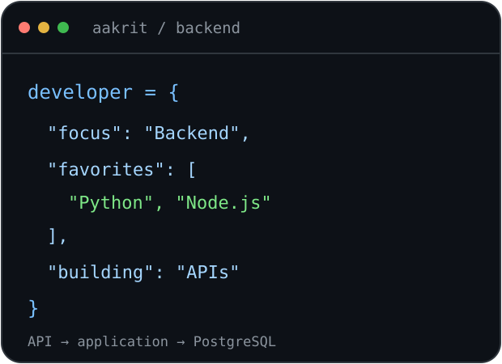

<h1 align="center">Hey 👋, I'm Aakrit Adhikari</h1>

  <b>Backend Developer · Python Enthusiast</b> 
  Building APIs and web applications with Node.js and Python.

  

---

### A little about me

- 💻 I work on backend development with **Node.js, PostgreSQL, Prisma, and TypeORM**.
- 🐍 I developed my **Python** skills by building projects with **FastAPI and Django**.
- ⚛️ I also work with **React and Next.js** to build web applications.
- 🎓 I've completed **data science certifications** and enjoy putting what I learn into projects.
- 🌱 I have foundational knowledge of **SQL, Docker, and deployment**, and I'm continuing to build on it.
- 💬 Happy to talk about **Python, backend development, and APIs**.

 

### Languages and Tools:

  &nbsp;&nbsp;
  &nbsp;&nbsp;
  &nbsp;&nbsp;
  &nbsp;&nbsp;
  &nbsp;&nbsp;
  &nbsp;&nbsp;
  &nbsp;&nbsp;
  &nbsp;&nbsp;
  &nbsp;&nbsp;
  &nbsp;&nbsp;
  

